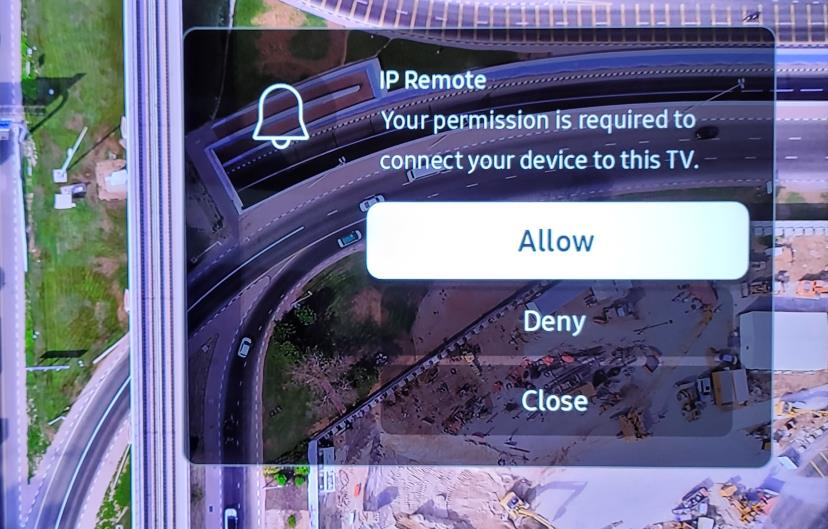

# SamsungController: installation to everyday use

This guide describes the **v1 direct-IP application**, now the default on main. For historical menu-key workflows, see [the v0 guide](v0-user-guide.md).

## Requirements and quick start

For a **downloaded app**, the .NET runtime is included: no .NET SDK/runtime install,
Git, Python, Node.js, Samsung SDK, or IDE is required. For **source builds**, install
the **.NET 10 SDK** (not the runtime alone); see [source setup](../README.md#install-and-run-from-source).
Both need a current browser with JavaScript and a Samsung display supporting HTTPS
IP Remote, on the same trusted local network. Allow Local Network/VPN LAN access.
macOS needs 14 or newer; see the [requirements table](../README.md#requirements)
for Windows/Linux dependencies and processor selection.

**Everyday workflow:** launch the app → Display → select/add a display → trust
and pair once → Connect and open Menu → edit values → Apply → Stop if needed →
Quit app. Closing the browser only hides the interface. A source server instead
runs in its terminal and stops with Ctrl+C.

**IP Remote must be enabled on the display.** Turn on **Power On with Mobile**
in the same menu before pairing. Keep the physical remote nearby to approve access.

## 1. Choose your download

Open the [official Releases page](https://github.com/whipstein/SamsungController/releases/latest).

| Computer | Package suffix |
| --- | --- |
| Apple silicon Mac | macos-arm64.dmg |
| Intel Mac | macos-x64.dmg |
| Intel/AMD Windows | windows-x64-setup.exe (installer) or windows-x64.zip (portable) |
| Windows on Arm | windows-arm64-setup.exe (installer) or windows-arm64.zip (portable) |
| Intel/AMD Linux | linux-x64.tar.gz |
| Arm64 Linux | linux-arm64.tar.gz |

The runtime is included. You do not need Git or a .NET installation. Linux still requires its normal native OS libraries: see [Microsoft's .NET Linux requirements](https://learn.microsoft.com/dotnet/core/install/linux).

Optional integrity checks against the release's SHA256SUMS.txt:

- macOS: `shasum -a 256 <archive>`
- Windows PowerShell: `Get-FileHash <archive> -Algorithm SHA256`
- Linux: `sha256sum <archive>`

## 2. Install and launch

### macOS

1. Double-click the downloaded **DMG**.
2. Drag **SamsungController.app** onto the **Applications** shortcut in that window.
3. Eject the SamsungController disk image in Finder.
4. Open **Applications → SamsungController**. It starts the server and opens your browser.
5. Allow **Local Network** access when prompted. Official release DMGs and apps are signed, notarized, and stapled. No .NET install or administrator installer script is needed.
6. If it cannot contact your TV, check **System Settings → Privacy & Security → Local Network** for SamsungController. Source builds need permission for their hosting Terminal/editor instead.

Do not run the app from inside the mounted DMG. When updating, quit the old copy
before replacing it in Applications. If macOS asks for permission to copy into
Applications, approve the normal Finder prompt yourself.

If SamsungController never appears in that list with v1.0.0, quit the old app and update to **v1.0.1 or later**. Install a single copy in Applications and open it there, then attempt Connect/Pair. The patch corrects permission attribution to the native app and its background server. You still need to click **Allow** in the macOS prompt; Developer ID signing does not grant Local Network permission. Your saved pairing credentials are retained. A separate TV approval may still be required for a display that has not yet paired.

### Windows

**Installer (recommended, v1.0.6 onward):**

1. Download and double-click the matching **windows-x64-setup.exe** or **windows-arm64-setup.exe**.
2. Follow Setup. The default location is `%LOCALAPPDATA%\Programs\SamsungController`; installation is for your user and needs no administrator rights.
3. Optionally select **Create a desktop shortcut**.
4. Leave **Start SamsungController and open the webpage** checked, then click **Finish**.
5. Next time, open **SamsungController** from the Start menu or your desktop shortcut. The server starts in the background and the webpage opens when ready.

**Portable ZIP (no installation):**

1. Right-click the ZIP and choose **Extract All** into a stable location.
2. Double-click **00 - Start SamsungController Server.exe**, the first file when sorting by name. In older v1.0.5 packages this was named **SamsungController.App.exe**.
3. Wait for the webpage to open automatically. Do not run inside ZIP preview or move the executable away from its companion files.
4. Use this launcher instead of **SamsungController.Web.exe**, which starts the optional foreground server without the normal browser-opening workflow.

Both options include .NET and reuse the same saved settings. Windows binaries and installers are unsigned. If SmartScreen warns, verify the download and checksum against the official repository before allowing it. If no webpage opens, visit **http://127.0.0.1:5050** and check that Windows has a default web browser configured.

**Update or uninstall:** choose **Quit app** first, then run the new installer. Setup and Uninstall refuse while a new-version server is running, instead of interrupting TV adjustments. Uninstall via **Windows Settings → Apps → Installed apps → SamsungController**. Your private settings and pairing credentials are retained. Portable users can extract an update into a new folder after quitting the old copy.

### Linux

1. Extract the whole tar.gz into a stable folder.
2. Run **SamsungController.App**; if your file manager asks, allow execution in file properties.
3. For an applications-menu entry, run `./install-shortcut.sh` once from that folder. It creates only a per-user shortcut, with no root access or login service.
4. A graphical browser and `xdg-open` are used to open the interface. You can also type the local URL manually.

For all platforms, the interface is **http://127.0.0.1:5050**. The server runs in the background, without a terminal window. Reopening the app reuses the existing instance.

## 3. Understand start, close, and quit

- Closing a browser tab does **not** stop the server.
- Open SamsungController again to return to the interface.
- To stop the server, use **Quit app** at the very top, beside **Stop**, on any page.
- If a TV operation is running, press **Stop** and review any unfinished-operation notice before quitting.
- The app does not start automatically at login. Your saved data is retained when you quit.
- An old foreground server may already occupy port 5050. Stop it in its original terminal before starting the packaged app; the launcher will not kill unrelated processes.

## 4. Prepare the TV

1. Turn the TV on and put it on the same trusted LAN as your computer.
2. Find its IP address in the network settings. A DHCP reservation avoids address changes.
3. **Enable IP Remote. This is required.** Turn **Power On with Mobile** on first.
4. Use the direct HTTPS port, normally **1516** (some older displays use 1515). This is not the older WebSocket interface on ports 8001/8002.
5. Do not expose either the TV service or SamsungController to the internet.

**Where is it?** See the [model-specific paths](../README.md#where-to-enable-ip-remote):
S95F uses **Connections → Network → Expert Settings**; the smart Odyssey G95SC
uses **Connection → Network → Expert Settings**; compatible older TVs use
**General → Network → Expert Settings**. These are under Settings / All Settings.
Firmware and region can change labels. Search your exact model's e-Manual for
IP Remote if needed. **Cable Box IP Remote is a different setting.**

## 5. Save and pair a display

1. On **Display**, select **Add display**.
2. Enter the display name and IP address. Normally leave port **1516**.
3. Click **Save display**. Leave advanced certificate settings unchanged.
4. Click **Trust this display and pair**.
5. Check the address and certificate. Tick the confirmation box.
6. Click **Confirm trust and pair**.
7. **On the TV**, select **Allow** with its physical remote.
8. Wait for Menu to open and current settings to load.

Example from [Samsung's IP-control worksheet, page 2](https://image-us.samsung.com/SamsungUS/samsungbusiness/tv-ci-resources/Samsung-IP-Control.pdf#page=2).
Appearance varies by model. This approval is on the TV, separate from the app's
certificate confirmation and macOS Local Network prompt.

**Missed it?** After the request finishes, click **Pair with TV** and watch for
the TV prompt again. **Next launch:** select the saved display and **Connect and
open Menu**. Do not pair again simply to reconnect.

If you used the v1 preview, its profiles/tokens are reused. A v0 WebSocket token is not a v1 HTTPS token.

**Already paired with Allow untrusted?** Select **Trust this display and connect**,
review and confirm. The app keeps the existing token and does not ask the TV to
approve again. On future visits simply Connect.

**What am I trusting?** This is trust on first use, not independently verified
identity. Check that the IP belongs to your display on a trusted LAN; compare its
fingerprint through another trusted source if available. The pin identifies the
display to the app; the token identifies the app to the display. Neither is an
OS permission, and no certificate/token needs to be entered on the TV manually.
Future certificate mismatches stop requests. Review shows the old/new fingerprints
with a distinct replacement confirmation. Investigate before approving; the app
never replaces a pin silently. Cancel leaves the old trust intact. Fingerprints
are visible during this review; diagnostic exports redact them by default.

## 6. Let the initial read finish

The connection reads all documented setting groups for the current signal. Already-enabled 20pt WB and Custom color modes load their rows. Unsupported or inactive values stay unreported, not zero or assumed defaults.

**Settings load** details and **Communication log** explain missing values. Stop cancels the remaining work. Opening a tab never silently resumes an incomplete scan; use an explicit refresh.

## 7. Navigate and adjust

Choose **Picture**, **2pt WB**, **20pt WB**, **Color**, **Sound**, or **System**.

- The tabs and Apply controls stay pinned while scrolling.
- Each tab remembers its position, including after leaving Menu or reloading in the same browser tab.
- **Help**, beside **Refresh state**, explains the current page/section. **README** beside Help opens the included manual in a new tab; it and this tutorial work offline.
- Picture, Sound, and System boxes can be dragged by their background/heading. Linked controls move together. Reset layout affects only the current section.
- The right-edge double chevron opens the remote without leaving the page.

### Safest first adjustment

For a narrow calibration window, select **Standard** at the very top to switch to **Compact**. This applies across all pages and is independent of light/dark mode. The original Standard layout remains available. In Compact, 20pt WB shows one percentage per row with RGB number fields and −/+ buttons instead of slider tracks; RGB ± adjusts the whole row and ✓ applies that row's staged edits. Hover over a value for the TV reading and bounds. Allow roughly 480–640 pixels of width and 800 pixels of page height at 100% zoom to see all 20 rows with optional details closed. Shorter windows scroll. Switching layouts never changes the TV or discards pending edits.

1. Leave **On Apply** selected and **Query first** checked.
2. Change a slider or type a number. Finish the number and leave the field to commit it locally.
3. Review the pending target. **TV:** shows the last queried value.
4. Select **Apply**. The app sends the change, reads it back, and checks the result.
5. Use **Discard** beside the section heading to discard unsent targets without changing the TV.

**Immediately** sends committed changes without a separate Apply. You can keep editing while earlier changes run; unsent targets combine rather than building an endless queue. Invalid or out-of-range entries send nothing.

### Calibration rows

- 2pt WB groups RGB gains and offsets into two columns.
- 20pt WB presents all percentage blocks together. Enable its switch and Apply before editing. On Apply mode includes an Apply button for each percentage.
- Color presents fixed RGB controls for every color. Choose Custom in Color space and Apply to enable them.
- Each 20pt percentage and Color block has **RGB together − / +** to adjust its three channels by one while preserving their differences. It follows On Apply / Immediately. If any channel reaches a limit, that direction is disabled for the group.
- Apply leaves the last used percentage/color selected. Loading rows restores the original selector.
- **Reset all** resets every RGB value in the selected calibration section to nominal: **0** for 20pt WB or **50** for Custom color. Confirm **Stage reset** to review before Apply, or **Reset now** in Immediately mode. All rows must be loaded and enabled. It replaces this section's unsent edits but leaves other settings and the WB/color-space mode unchanged; it is not a picture/factory reset.
- Do not apply an input/picture-mode change together with dependent calibration changes.

### Save a calibration and recall it later

1. Finish applying your changes. Use **Refresh state** if anything was changed outside this app.
2. Click **Save settings** beside Home and Back, enter a name in the popup, and click **Save current settings**. This includes all loaded settings across all tabs, not just the current page. Expand **Settings included across all tabs** to check coverage. No TV commands are sent by Save.
3. Later, click **Recall settings** in the same header and select the state from the dropdown. Review its saved values and missing values, and use the same display/input/picture mode/physical signal.
4. Click **Recall settings…**, confirm the conditions, then **Apply saved state now**. The app restores available values and reports any it could not apply. This sends changes even when ordinary edits use On Apply.
5. Use **Stop** if anything goes wrong. Earlier changes stay on the TV; check the display and follow the recall-review instructions before continuing.
6. To delete a saved calibration, select it, click **Delete state**, and confirm. This only removes the file, never the TV's current settings.

Save captures loaded TV readings—not unsent edits or guessed defaults. Load the calibration rows before saving if you want them included. Recall can temporarily enable 20pt WB or Custom color to restore saved RGB rows, then restores the saved mode. Your saved files stay in the private data folder across app updates. The current app's states are not the old menu-traversal calibration-file format.

## 8. Refresh deliberately

- **Refresh state** reads all settings for the current signal and discards unsent targets.
- **Refresh section** rereads only the current section.
- **Reload all rows** is enabled only in 20pt WB and Color.
- Explicit 20pt WB refresh can temporarily enable WB to read values while Off, then restores its original interval and Off. No RGB value is changed.
- Remote keys keep cached readings unchanged. Refresh after using another controller or changing the HDMI signal/picture mode.
- Keep the physical signal stable during reads and writes.

Turning **Query first** Off is faster but assumes the last queried values are still correct and no other controller changed the TV. Post-change checks remain enabled.

## 9. Stop, recover, and diagnose

**Stop** cancels unsent work; delivered changes are not undone. If a write or temporary WB read is interrupted, follow the visible recovery controls. Do not continue on an uncertain baseline.

For connection stalls, try **Reset connection (keep pairing)** on Display. It refreshes the local HTTPS connection without requesting new TV approval. It cannot restart a failed TV-side IP service.

Check TV power/address/port, IP Remote, certificate trust, Local Network permission, VPN LAN-access settings, and firewall rules. In Proton VPN, check **Allow LAN connections**. Restart the hosting app/server after permission changes.

**Communication log** shows requests and replies. Filter/search, expand TX/RX, and export relevant records. Tokens are always redacted; leave device-identifier and SHA redaction enabled before sharing. Review free-text labels.

If the desktop app fails before the browser opens, inspect `desktop/last-launch-error.txt` and `desktop/server.log` within the private configuration folder shown below.

## 10. Update without losing data

1. Stop TV operations, then **Quit app**. Stop any old foreground server with Ctrl+C.
2. Back up the private configuration folder.
3. Download the new official package for your OS/processor.
4. Replace the macOS app, run the new Windows installer, or extract a Windows/Linux portable package into a new stable folder. Do not overwrite a running installation.
5. Reopen the app and connect to the saved display.
6. If using the Linux menu shortcut, rerun the shortcut installer from the new folder.
7. Hard-refresh the browser if old styling remains cached.

Private data normally lives in:

- macOS: `~/Library/Application Support/SamsungController/`
- Windows: `%APPDATA%\SamsungController\`
- Linux: `${XDG_CONFIG_HOME:-~/.config}/SamsungController/`

Direct-IP profiles, tokens, preferences, and logs are under `ip-remote/`. Background-server metadata/logs are under `desktop/`. Neither folder belongs in a distributable package.

For source builds and the optional CLI, see the [README](../README.md). The CLI retains its existing WebSocket/menu-key workflows; it is separate from the v1 direct-IP web interface.
